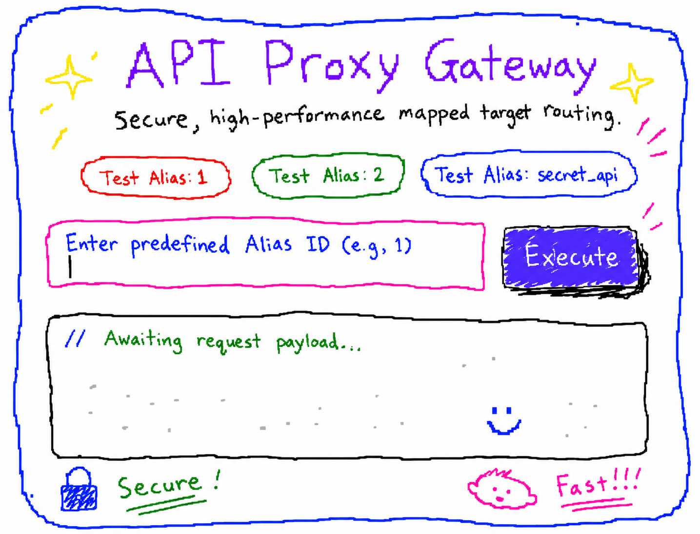

# OurOrigins - Nexus CORS Proxy Gateway 🚀

[](https://golang.org/)
[](LICENSE)
[](#)

**OurOrigins** is a high-performance, open-source CORS Proxy and API Gateway built entirely in Go (Golang) utilizing exclusively the standard library (Zero Dependencies). 

Engineered for maximum security and speed, it implements a strict "Pre-configured Aliases" architecture. API routes are parsed and loaded directly into RAM during server startup, ensuring blazing-fast $O(1)$ time complexity for request routing with absolutely zero disk I/O per request.



---

## ✨ Key Features

* 🚀 **High Performance & Zero Dependencies:** Built strictly with the standard `net/http` package to achieve maximum throughput and minimal resource footprint.
* 🔒 **Architectural Security (API Gateway Pattern):** Target URLs are never exposed to the client. The system strictly processes pre-defined "Alias IDs". Unmapped requests are instantly rejected.
* ⚡ **In-Memory Caching:** The `config.json` mapping is parsed exactly once at server boot and cached in memory, guaranteeing $O(1)$ lookup times.
* 🎨 **Glassmorphism UI:** Features an elegant, built-in Dark Mode dashboard for testing and debugging mapped aliases directly from the browser.
* 🔄 **Dynamic Response Formatting:** Native support for mutating responses into `raw` (passthrough), `json`, or `jsonp` formats based on the strict configuration map.
* ⏱️ **Robust Error & Timeout Management:** Equipped with a strictly configured HTTP client (10-second timeout boundary) to prevent request hanging and resource exhaustion.

---

## 📂 System Architecture

The project is designed to be extremely lightweight, consisting of exactly 4 core files:

```text
OurOrigins/
├── main.go       # Entry point, configuration loader, and HTTP server initialization
├── proxy.go      # The core proxy engine (request construction, execution, and formatting)
├── config.json   # The local routing database mapping aliases to targets
└── index.html    # The modern Frontend Graphical User Interface

```

---

## 🛠️ Installation & Setup

### Prerequisites:

* Go (Version 1.20 or higher)

### 1. Clone the Repository

```bash
git clone [https://github.com/a9ii/OurOrigins.git](https://github.com/a9ii/OurOrigins.git)
cd OurOrigins

```

### 2. Configure Target Mappings

Edit the `config.json` file to define your secure aliases:

```json
{
  "1": {
    "target_url": "[https://jsonplaceholder.typicode.com/users/1](https://jsonplaceholder.typicode.com/users/1)",
    "format": "json"
  },
  "secret_api": {
    "target_url": "[https://api.example.com/v1/data](https://api.example.com/v1/data)",
    "format": "raw"
  }
}

```

### 3. Development Run

Run the application directly to test your configurations:

```bash
go run main.go proxy.go

```

*The server will start on: `http://localhost:29050` (or the port defined in `main.go`).*

### 4. Production Build

For production environments, compile the application into a highly optimized, standalone binary:

```bash
go build -o cors-gateway main.go proxy.go
./cors-gateway

```

---

## 📖 Usage API

Once the server is running, you can execute HTTP GET requests by passing the `cros` query parameter which corresponds to your Alias ID:

**Standard JSON Request:**

```http
GET /get?cros=1

```

**JSONP Request (with dynamic callback):**

```http
GET /get?cros=secret_api&callback=myFrontendFunction

```

> **Security Note:** If a client requests a `cros` alias that does not exist in the in-memory map, the server will immediately drop the request and return a `403 Forbidden` status to prevent discovery attacks.

---

## 🌐 Production Deployment

For a robust production environment, it is highly recommended to run the binary as a **Systemd** background service and place it behind **Nginx** as a Reverse Proxy.

### Nginx Reverse Proxy Configuration:

```nginx
server {
    listen 80;
    server_name api.yourdomain.com; # Replace with your domain

    location / {
        proxy_pass [http://127.0.0.1:29050](http://127.0.0.1:29050);
        proxy_set_header Host $host;
        proxy_set_header X-Real-IP $remote_addr;
        proxy_set_header X-Forwarded-For $proxy_add_x_forwarded_for;
        proxy_set_header X-Forwarded-Proto $scheme;
    }
}

```

---

## 🤝 Contributing

Contributions are always welcome! Whether it's a performance improvement, a bug fix, or a new feature, please feel free to contribute.

1. Fork the Project
2. Create your Feature Branch (`git checkout -b feature/AmazingFeature`)
3. Commit your Changes (`git commit -m 'Add some AmazingFeature'`)
4. Push to the Branch (`git push origin feature/AmazingFeature`)
5. Open a Pull Request

---

## 📜 License

This project is licensed under the MIT License - see the [LICENSE](https://github.com/a9ii/OurOrigins/blob/main/LICENSE) file for details.

---


